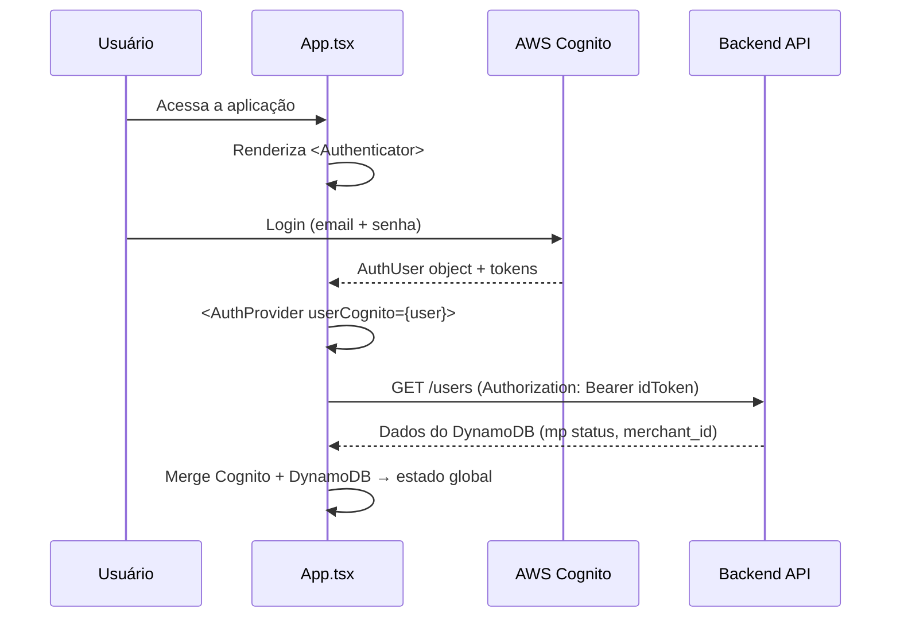
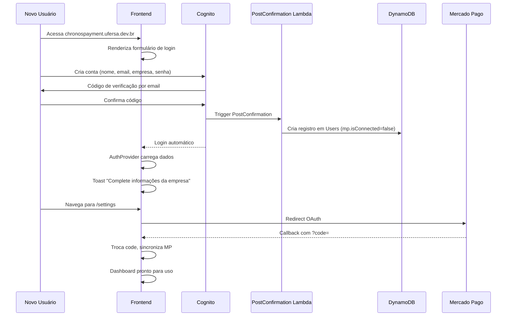

# Chronos Pay — Frontend

Dashboard de gestão de pagamentos e assinaturas recorrentes, construído com React + Vite + TailwindCSS, integrado ao backend serverless AWS e autenticação via Cognito.

---

## Sumário

- [Visão Geral](#visão-geral)
- [Stack Tecnológica](#stack-tecnológica)
- [Estrutura de Pastas](#estrutura-de-pastas)
- [Configuração do Ambiente](#configuração-do-ambiente)
- [Autenticação (Cognito + Amplify)](#autenticação-cognito--amplify)
- [Arquitetura da Aplicação](#arquitetura-da-aplicação)
- [Páginas](#páginas)
- [Contextos (State Global)](#contextos-state-global)
- [Hooks](#hooks)
- [Camada de API](#camada-de-api)
- [Componentes](#componentes)
- [Agente AI (Chat)](#agente-ai-chat)
- [Fluxos Principais](#fluxos-principais)
- [Desenvolvimento Local](#desenvolvimento-local)
- [Build e Deploy](#build-e-deploy)

---

## Visão Geral

O frontend é um **dashboard SPA (Single Page Application)** para vendedores gerenciarem:
- **Transações financeiras** — visualizar, filtrar e paginar pagamentos recebidos
- **Planos de assinatura** — criar, editar e monitorar planos recorrentes
- **Assinantes** — ver quem está assinando cada plano
- **Integração Mercado Pago** — conectar/sincronizar via OAuth
- **Perfil corporativo** — configurar nome da empresa, logo, setor
- **Assistente AI** — chat com agente inteligente para gerenciar o sistema por linguagem natural

---

## Stack Tecnológica

| Tecnologia | Versão | Uso |
|------------|--------|-----|
| React | 18.3 | Framework UI |
| Vite | 7.x | Build tool + dev server |
| TypeScript | 4.9 | Tipagem estática |
| TailwindCSS | 4.x | Estilização utility-first |
| AWS Amplify UI | 6.x | Componentes de autenticação Cognito |
| aws-amplify | 6.x | SDK de autenticação |
| React Router DOM | 7.x | Roteamento SPA |
| TanStack React Query | 5.x | Gerenciamento de estado de servidor (cache, paginação) |
| React Hook Form | 7.x | Formulários performáticos |
| Zod | 4.x | Validação de schemas |
| Axios | 1.x | Cliente HTTP |
| Motion (Framer) | 12.x | Animações |
| Lucide React | 0.564 | Ícones |
| Sonner | 2.x | Toast notifications |
| React Markdown | 10.x | Renderização de markdown (chat AI) |
| mercadopago | 3.x | Tipos TypeScript do SDK (reutilizados do backend) |

---

## Estrutura de Pastas

```
Chronos_Pay_System_Front/
├── .env                        # Variáveis de ambiente (VITE_API_URL, VITE_MP_CLIENT_ID)
├── amplify_outputs.json        # Configuração do Cognito User Pool
├── index.html                  # HTML base
├── package.json                # Dependências
├── vite.config.js              # Config do Vite
├── tsconfig.json               # Config TypeScript
│
├── public/                     # Assets estáticos
│   └── images/                 # Logos, ícones
│
├── src/
│   ├── main.jsx                # Entry point (ThemeProvider + Toaster)
│   ├── App.tsx                 # Root component (Authenticator + Layout + Router)
│   ├── index.css               # Estilos globais + Tailwind
│   │
│   ├── pages/                  # Páginas da aplicação
│   │   ├── Transactions.tsx    # Lista de transações com filtros e paginação
│   │   ├── PlanPage.tsx        # Grid de planos de assinatura
│   │   ├── SubscribersPlanPage.tsx  # Assinantes de um plano específico
│   │   ├── ProfilePage.tsx     # Perfil do usuário (logo, dados corporativos)
│   │   ├── SettingsPage.tsx    # Integração OAuth Mercado Pago
│   │   ├── Dashboard.tsx       # (Placeholder para futuro dashboard)
│   │   ├── ErrorPage.tsx       # Página de erro
│   │   └── LoadingPage.tsx     # Página de loading
│   │
│   ├── context/                # Contextos React (state global)
│   │   ├── AuthContext.tsx     # Dados do usuário autenticado + MP status
│   │   └── AgentContext.tsx    # Estado do chat AI (mensagens, WebSocket)
│   │
│   ├── hooks/                  # Custom hooks
│   │   ├── useTransactions.ts  # Paginação cursor-based de transações
│   │   ├── usePlans.ts        # CRUD de planos (create, list, update)
│   │   ├── useSubscribers.ts  # Lista assinantes de um plano
│   │   └── useClipboard.ts    # Copiar para clipboard
│   │
│   ├── api/                    # Camada de comunicação com backend
│   │   ├── Users.ts           # GET /users, PUT /users
│   │   ├── plans.ts           # CRUD /plans, /plans/{id}/subscriptions
│   │   ├── fetchTransactions.ts  # GET /payments (paginação)
│   │   └── fetchOAuthMercadoPago.ts  # POST /oauth, GET /oauth
│   │
│   ├── Agent/                  # Módulo do agente AI
│   │   └── agentStream.ts     # Client de streaming SSE para o chat
│   │
│   ├── components/             # Componentes reutilizáveis
│   │   ├── Agent/             # Componentes do chat AI
│   │   │   └── AgentChat.tsx  # Widget de chat flutuante
│   │   ├── Button/            # Botão com ícone (composição)
│   │   ├── Table/             # Tabela de transações (composição)
│   │   ├── Plans/             # Cards de planos + modais
│   │   ├── TransactionsPage/  # Filtros e busca de transações
│   │   ├── Modal.tsx          # Modal genérico com backdrop
│   │   ├── InputField.tsx     # Input com label e erro
│   │   ├── Select.tsx         # Select customizado
│   │   ├── Skeleton.tsx       # Loading skeleton
│   │   ├── LoadingCircle.tsx  # Spinner
│   │   ├── PaymentMethodBadge.tsx  # Badge de método (Pix/Cartão/Boleto)
│   │   ├── statusBadge.tsx    # Badge de status colorido
│   │   ├── TransactionModal.tsx    # Modal de detalhes da transação
│   │   ├── copyButton.tsx     # Botão de copiar
│   │   └── ...
│   │
│   ├── layout/                 # Componentes de layout
│   │   ├── Sidebar.tsx        # Sidebar com navegação (desktop)
│   │   ├── Header.tsx         # Header mobile com hamburger menu
│   │   └── Page/              # Composição de layout de página
│   │
│   ├── routes/
│   │   └── routes.tsx         # Definição de rotas (lazy loading)
│   │
│   ├── cognito/               # Customização da UI do Cognito
│   │   ├── components.jsx     # Header/footer do formulário de login
│   │   └── formFields.js      # Campos customizados (nome, empresa, etc.)
│   │
│   ├── schemas/               # Schemas de validação (Zod)
│   │   └── planSchema.ts     # Validação de criação/edição de plano
│   │
│   ├── types/                 # Interfaces TypeScript
│   │   ├── auth.ts           # AuthUserDynamo, Company, MercadoPagoIntegration
│   │   ├── PlanTypes.ts      # Tipos de plano
│   │   └── transactionFilters.ts  # Filtros de transação
│   │
│   ├── constants/
│   │   └── constants.ts      # Traduções de status MP, estilos, labels
│   │
│   ├── styles/
│   │   └── cognito.css       # Estilos do formulário Cognito
│   │
│   └── utils/                 # Utilitários
│       ├── Authorizer.ts     # Extrai ID Token do Cognito (fetchAuthSession)
│       ├── DateUtils.ts      # Formatação de datas
│       ├── StringUtils.ts    # Truncar strings, capitalizar, etc.
│       └── HandleImageChange.ts  # Upload de imagem (preview local)
```

---

## Configuração do Ambiente

### Variáveis de Ambiente (`.env`)
```env
VITE_API_URL=https://api.chronospayment.ufersa.dev.br
VITE_MP_CLIENT_ID=1549445475571223
```

### Cognito (`amplify_outputs.json`)
```json
{
  "auth": {
    "user_pool_id": "us-east-1_cOKoNe0q0",
    "aws_region": "us-east-1",
    "user_pool_client_id": "1so2d2o2var3n9qsg6kbekkgua",
    "username_attributes": ["email"],
    "password_policy": {
      "min_length": 8,
      "require_lowercase": true,
      "require_numbers": true,
      "require_symbols": true,
      "require_uppercase": true
    }
  }
}
```

---

## Autenticação (Cognito + Amplify)

### Fluxo



### Estrutura de Auth
1. **`Authenticator`** (Amplify UI) — renderiza formulário de login/signup com traduções pt-BR
2. **`AuthProvider`** — ao receber o `user`, faz:
   - `getUser()` → busca dados do DynamoDB (mp.isConnected, public_key)
   - `fetchUserAttributes()` → busca atributos do Cognito (name, email, custom:company_name)
   - Merge tudo no estado global via `useAuth()`
3. **`getCognitoIdToken()`** — utilitário que extrai o ID Token da sessão Amplify para enviar como `Authorization: Bearer` em todas as requisições

---

## Arquitetura da Aplicação

```
<ThemeProvider>
  <Toaster />
  <Authenticator>
    <AuthProvider>
      <BrowserRouter>
        <QueryClientProvider>
          <main>
            <Sidebar />
            <div>
              <MobileHeader />
              <AppRoutes />    ← Lazy-loaded pages
            </div>
            <AgentProvider>
              <AgentChat />    ← Widget flutuante
            </AgentProvider>
          </main>
        </QueryClientProvider>
      </BrowserRouter>
    </AuthProvider>
  </Authenticator>
</ThemeProvider>
```

### Rotas

| Rota | Página | Descrição |
|------|--------|-----------|
| `/transactions` | `Transactions.tsx` | Lista de transações (página padrão) |
| `/plans` | `PlanPage.tsx` | Grid de planos de assinatura |
| `/plans/:plan_id/subscribers` | `SubscribersPlanPage.tsx` | Assinantes de um plano |
| `/profile` | `ProfilePage.tsx` | Perfil do usuário |
| `/settings` | `SettingsPage.tsx` | Integração Mercado Pago |
| `/reports` | (Placeholder) | Relatórios (em breve) |
| `*` | Redirect → `/transactions` | Fallback |

Todas as páginas usam **lazy loading** com `React.lazy()` + `Suspense`.

---

## Páginas

### Transactions (Transações Financeiras)
- **Tabela paginada** com cursor-based pagination (DynamoDB `LastEvaluatedKey`)
- **Filtros:** por nome do pagador, status, método de pagamento
- **Busca:** campo de texto que filtra por nome
- **Modal de detalhes:** ao clicar em uma transação, abre modal com informações completas
- **Skeleton loading** enquanto carrega
- **Empty state** quando não há transações

### PlanPage (Planos de Assinatura)
- **Grid responsivo** de cards de planos (4 colunas desktop, 1 mobile)
- **Card de plano:** mostra nome, valor, frequência, status, contagem de assinantes
- **Botão "Novo Plano":** abre modal com formulário validado (Zod + React Hook Form)
- **Campos do formulário:** reason, valor, frequência (meses/dias), repetições, back_url, free trial opcional

### SettingsPage (Integração Mercado Pago)
- **Status da conexão:** badge Ativo/Inativo
- **Botão OAuth:** redireciona para `auth.mercadopago.com.br` com redirect_uri
- **Callback:** ao retornar com `?code=`, chama `POST /oauth` automaticamente
- **Credenciais:** exibe Public Key, User ID, Merchant ID com botão de copiar

### ProfilePage (Perfil)
- **Foto/Logo:** upload local com preview (ainda sem persistência no backend)
- **Dados pessoais:** nome e email (somente leitura, vem do Cognito)
- **Dados corporativos:** nome na fatura (max 12 chars), website, setor de atuação
- **Salvar:** atualiza atributos customizados no Cognito via `updateUserAttributes()`

---

## Contextos (State Global)

### `AuthContext`
| Campo | Tipo | Descrição |
|-------|------|-----------|
| `user` | `AuthUserDynamo \| null` | Dados completos do usuário |
| `isLoading` | `boolean` | Carregando dados do usuário |
| `mpConnected` | `boolean` | Se MP está conectado |
| `updateUser(data)` | `function` | Atualiza atributos do Cognito |

### `AgentContext`
| Campo | Tipo | Descrição |
|-------|------|-----------|
| `messages` | `Message[]` | Histórico de mensagens do chat |
| `isLoading` | `boolean` | Agente processando |
| `isOpen` | `boolean` | Chat aberto |
| `isMinimized` | `boolean` | Chat minimizado |
| `onSend(message)` | `function` | Envia mensagem para o agente |

---

## Hooks

### `useTransactions({ page, pageSize, filters })`
- Usa **React Query** com paginação cursor-based
- Armazena cursores por página em `useRef` para navegar para frente/trás
- `staleTime: 60s`, 3 retries

### `usePlans()`
- Busca todos os planos do usuário
- Cache **infinito** (nunca refetcha automaticamente)
- `staleTime: Infinity`, sem refetch on focus/mount/reconnect

### `useCreatePlan()`
- Form com React Hook Form + Zod validation
- Submete via `createPlan()` e recarrega a página

### `useUpdatePlan(plan)`
- Pré-popula form com dados do plano existente
- Submete via `updatePlanById()`

### `useSubscribers(planId)`
- Busca assinantes de um plano específico

---

## Camada de API

Todas as funções de API seguem o padrão:
1. Obtém ID Token via `getCognitoIdToken()`
2. Faz request com `axios` passando `Authorization: Bearer ${idToken}`
3. Exibe toast de erro via `sonner` se falhar

| Função | Método | Endpoint | Descrição |
|--------|--------|----------|-----------|
| `getUser()` | GET | /users | Dados do usuário |
| `updateUserProfile(data)` | PUT | /users | Atualiza perfil |
| `createPlan(data)` | POST | /plans | Cria plano |
| `fetchPlans()` | GET | /plans | Lista planos |
| `updatePlanById(id, body)` | PUT | /plans/{id} | Edita plano |
| `fetchSubscriptionsByPlanId(id)` | GET | /plans/{id}/subscriptions | Lista assinantes |
| `fetchTransactionsWithPagination(...)` | GET | /payments?pageSize&lastEvaluatedKey&filters | Transações paginadas |
| `fetchOAuthMercadoPago(userId, code)` | POST | /oauth?code= | Troca code por tokens |
| `getOAuthMercadoPago(userId)` | GET | /oauth?user_id= | Status da conexão |

---

## Agente AI (Chat)

### Arquitetura

[](https://mermaid.live/edit#pako:eNp9lE1u2zAQha9CcJWgsiPZlh0TaAAj2QRI0KCON4U2E5GWiYikS1KFasPbHqA36Fl6k56kpGjJ-VHLlYj5Zt6bIak9zhVlmOBMGva1YjJnNxwKDSKTyK0taMtzvgVp0QqBQStT_f6luXofvt6A9cSiYNL6TQ9i6xOhpGV1D7S0moHwHHgubIfWvCcXD7ceuwPxRCFUdVDgVoOrK2-CoBtecAtIMGlcwWNfPuQJWxOk5JJJeiaY8cD5EbB1GzfM3po7BZTL4szqqgdZUOdJyZMKogpVr0YV6NCNrynpfRBsfLfqkVc7BsxRJ-S4ZNcvQQ-flo_oAvhFHkb8hvm3HeEOukS5EsjPHX2DXWMt5JdKbdFnBhSeShaKhYBfTnfwwnu-qeQzoqypo05Y56EF11VZPnqtDx9DUg_bTrjtGf358ROBraDkO-ffFJ31U7IfZXe8mg20GybTXWvKX5KcwzHDBd-OqdMNV23NZSNH1f_Pfg2leXn4PR6aUpnMJI5woTnFpEmKsGBagN_jvS-QYbthgmWYuE8K-jlzL_DgktzF_qKUwMRftAhrVRWbdlNtKdj2fXaVg_K1qqTFZDSdNDUw2eMak2Q0HabxeJrE6XiUJLN5GuHvmIyT4SQepZPZKI7j-XR2iPCuEY2Hl0k8TsdJOp_Hk8llhBnlVun78JPIlVzzAh_-Agd9YSg)

### Componentes
- **AgentChat** — widget flutuante no canto inferior direito
- **Markdown rendering** — respostas do agente renderizadas com `react-markdown`
- **Mensagem inicial** — "Olá, {nome}! Sou o assistente inteligente..."

---

## Fluxos Principais

### Fluxo Completo: Primeiro Acesso



---

## Desenvolvimento Local

### Pré-requisitos
- Node.js >= 18
- npm ou yarn

### Comandos
```bash
# Instalar dependências
npm install

# Rodar dev server (com HTTPS via mkcert)
npm run dev

# Build de produção
npm run build

# Preview do build
npm run preview

# Lint
npm run lint

# Format (Prettier + ESLint fix)
npm run format
```

### Dev Server
O Vite roda em `https://localhost:5173` (com certificado local via `vite-plugin-mkcert`).

---

## Build e Deploy

### Build
```bash
npm run build    # Gera dist/ com assets otimizados
```

### Deploy
O frontend é hospedado via **AWS Amplify Hosting** (ou qualquer CDN de arquivos estáticos). O deploy é configurado no console do Amplify conectado ao repositório Git.

### Variáveis de Ambiente em Produção
Configurar no painel do Amplify Hosting:
- `VITE_API_URL` → URL do API Gateway
- `VITE_MP_CLIENT_ID` → Client ID do Mercado Pago